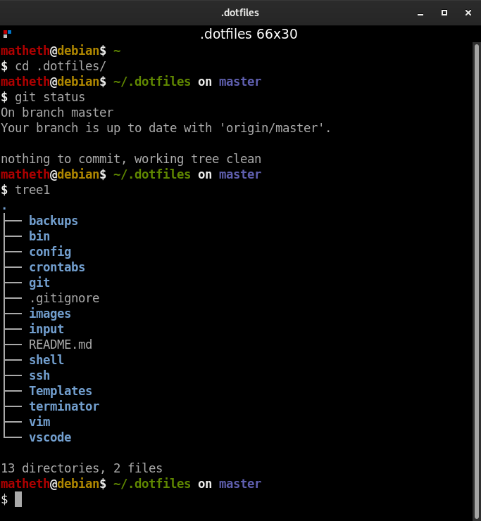

# Configuration files

## Demo


Bash Demo                  |  Zsh Demo
:-------------------------:|:-------------------------:
   |  

## To restore files
1. Install stow `sudo apt install stow`
2. cd into home directory
3. `rm -rf .dotfiles` if there is one
4. clone repository
5. run `rm .bashrc`
6. cd into .dotfiles
7. run `rm README.md`
8. run `stow -nvSt ~ *` to see what changes will be made
9. if all looks okay run `stow -vSt ~ *`
10. change cursor to I-beam: Terminal -> right click -> preferences -> Cursor shape -> I beam

All together:
```
    sudo apt install stow
    cd ~
    rm -rf .dotfiles
    git clone https://github.com/agustinntarias/.dotfiles.git
    rm .bashrc
    cd .dotfiles
    rm README.md
    stow -vSt ~ *
```

## Linking and unlinking in stow:

[Video explaining how it works](https://www.youtube.com/watch?v=CFzEuBGPPPg)

### To link:

    stow -nvSt ~ [folder name1] [folder name2] ...

- -n flag: preview mode (erase n to actually perform the command)
- -v flag: verbose
- -S flag: (Optional) stow (or link) [folder name1],[folder name2], ...
- -t ~ flag: target home directory

### To unlink

    stow -nvDt ~ [folder name1] [folder name2] ...

- -D flag: unstow (or unlink)

### Backup wider system files

#### Keyboard:
[link to full explanation](https://askubuntu.com/questions/682513/how-to-backup-restore-system-custom-keyboard-shortcuts#844907)

Gnome-Control-Center (used by Unity and Gnome Shell) stores its key bindings in the per-user Dconf database directories /org/gnome/desktop/wm/keybindings/ and /org/gnome/settings-daemon/plugins/media-keys/ (source).

The easiest way to keep them across system re-installations is to keep the per-user configuration directories (~/.config or more specifically ~/.config/dconf/user for Dconf only). Most of the time it's not necessary or desirable to purge the per-user configuration files anyway.

If you can't or won't keep your old Dconf database you can use the dconf command to export (“dump”) parts of it into a file and import (“load”) it later. The relevant Dconf directories are

+ /org/gnome/desktop/wm/keybindings/ for pre-defined shortcuts and
+ /org/gnome/settings-daemon/plugins/media-keys/custom-keybindings/ for custom, user-defined shortcuts.

The following example saves the above Dconf directories to two files keybindings.dconf and custom-keybindings.dconf and then restores them from the same files:
  
##### Backing up

```
    dconf dump '/org/gnome/desktop/wm/keybindings/' > ~/.dotfiles/backups/.backups/keybindings.dconf
    dconf dump '/org/gnome/settings-daemon/plugins/media-keys/custom-keybindings/' > ~/.dotfiles/backups/.backups/custom-keybindings.dconf
```

##### Restoring configuration
```
    dconf load '/org/gnome/desktop/wm/keybindings/' < ~/.dotfiles/backups/.backups/keybindings.dconf
    dconf load '/org/gnome/settings-daemon/plugins/media-keys/custom-keybindings/' < ~/.dotfiles/backups/.backups/custom-keybindings.dconf
```

#### Installed software:
[link to full explanation](https://www.nixtutor.com/linux/keep-a-backup-of-installed-packages/)

##### Backup

```
	dpkg --get-selections > ~/.dotfiles/backups/.backups/installed-software.log
```

##### Restore

```
	dpkg --set-selections < ~/.dotfiles/backups/.backups/installed-software.log
	apt-get dselect-upgrade
```

#### System backup
[link to full explanation](https://www.addictivetips.com/ubuntu-linux-tips/back-up-the-gnome-shell-desktop-settings-linux/)


### Back Up System Settings (dconf)

Creating a full backup with Dconf will allow you to save all Dconf settings and configurations, along with the Gnome Shell desktop environment. For most users this is overkill. However, if you’re paranoid and want to ensure that every setting is safe, this is the way to go.


#### Backup

Open up a terminal and use the dconf dump command to export the entire Dconf database to your Linux PC. DO NOT USE SUDO!

```
	dconf dump / > ~/.dotfiles/backups/.backups/full-backup
```

The settings dump is complete. The next step is to look over the contents of the file, to verify that the backup ran correctly. Using cat will print the contents of the data in a terminal, and allow you to look it over.

```
	cat ~/.dotfiles/backups/.backups/full-backup
```

If everything looks good, type clear and create a new folder in ~/.backups to hold the backup file. 

```
	mkdir -p ~/.backups
	touch ~/.backups/full-backup 
```

#### Restore Backup


Download the \<file\> to your Linux PC and open up a terminal. In the terminal, use the cd command to access the files inside.

```
	cd ~/Downloads
```

Start the restoration process by importing the Dconf backup file into the system.

##### Full Restore Command

```
	dconf load / < \<file\>
```
